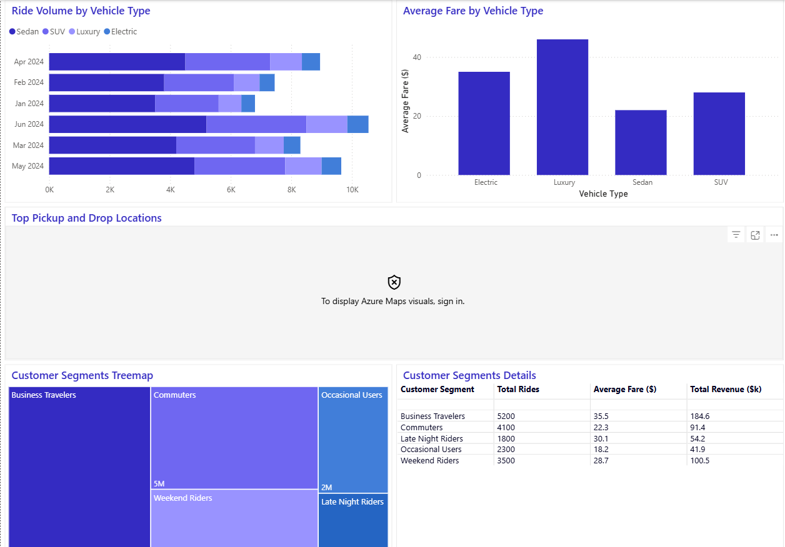

# OLA Ride-Hailing Data Analysis 🚕📈

This project analyzes ride-hailing operational data to observe demand patterns, driver performance, customer behavior, revenue trends, and cancellation metrics. The insights help improve fleet allocation, dynamic pricing, and user experience.

---

## 🎯 Project Objectives
- Identify peak booking demand by day and hour
- Understand driver and customer cancellation patterns
- Analyze booking value trends and revenue drivers
- Segment customers to enable targeted growth strategies

---

## 🧰 Tools & Technologies Used
| Category | Tools |
|---------|-------|
| Programming | Python (Pandas, NumPy) |
| Visualization | Matplotlib, Seaborn |
| Dashboarding | **Power BI** |
| Data Source | Kaggle – OLA Ride Dataset |
| Notebook | Jupyter Notebook |

---

## 📊 Key Metrics & Business Insights
- **Completion Rate:** Indicates trip success reliability
- **Driver & Customer Cancellation Rates:** Reveals operational bottlenecks
- **Average Driver Rating:** Impacts customer satisfaction & repeat bookings
- **Demand Patterns:** Helps optimize driver allocation

---

## 🖥 Dashboard Previews

### Main Performance Dashboard

### Driver Ratings, Ride Patterns & Fare Behavior

### Customer Segmentation & Revenue Contribution

---

## 📁 Project Structure
ola_Data_Analysis/
│── OLA_analysis.ipynb # EDA + Metrics Calculation
│── dashboard_overview.png # Screenshot 1
│── dashboard_insights.png # Screenshot 2
│── dashboard_segments.png # Screenshot 3
└── README.md # Project Documentation

yaml
Copy code

---

## ✅ Conclusion
This analysis provides clear visibility into ride demand behavior, operational gaps, and customer segmentation. These insights enable improvement in:
- Fleet & driver scheduling
- Surge pricing strategy
- Customer retention and targeted offers
